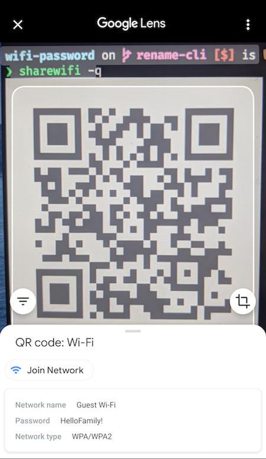
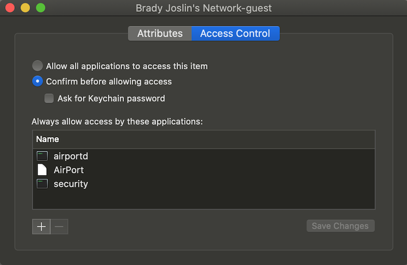

# Share Wi-Fi Connection Info on macOS

Quickly share Wi-Fi passwords and connection details. Generates QR codes that auto-configure iOS and Android devices.

## Usage

```text
sharewifi 0.1.5
Quickly share Wi-Fi passwords and connection details

USAGE:
    sharewifi [FLAGS] [OPTIONS]

FLAGS:
    -a, --always-allow    Disables future confirmation prompts to access this password. Sudo required
    -h, --help            Prints help information
    -q, --qrcode          Prints Wi-Fi Network config QR Code for Android and iOS 11+
    -V, --version         Prints version information
    -v, --verbose         Verbose output

OPTIONS:
    -s, --ssid <ssid>    Specify an SSID.  Defaults to currently connected Wi-Fi
```


Google Lens displaying QR Code details along with button to join network with single tap:



## Installing with Homebrew

The easiest way to install sharewifi is by using Homebrew.

```bash
brew tap bradyjoslin/sharewifi
brew install sharewifi
```

## Building and Installing

Building and installing requires [Rust](https://www.rust-lang.org/tools/install). To build, clone the repository and then:

```bash
cargo build
```

To run the debug build:

```bash
cargo run
```

To create a release build:

```bash
cargo build --release
```

To install:

```bash
cargo install --path .
```

## Behind the Scenes

Uses two built-in macOS CLI utilities to function under the hood. `airport` gets information on currently connected Wi-Fi, `security` is used to obtain password. Running `security` provides a login prompt to access keychain, as authentication is required in order to obtain the password.

Default macOS `airport` utility location:

`/System/Library/PrivateFrameworks/Apple80211.framework/Versions/Current/Resources/airport`.

Sample usage to obtain SSID:

```bash
> airport -I | awk '/ SSID/ {print substr($0, index($0, $2))}'

Guest WiFi
```

Uses `security` utility to obtain password associated with SSID ([details](https://macromates.com/blog/2006/keychain-access-from-shell/)).

```bash
> security find-generic-password \
-D 'AirPort network password' \
-ga "Guest WiFi" \
2>&1 >/dev/null

password: "HelloFriends!"
```

QR Code format described in [ZXing docs](https://github.com/zxing/zxing/wiki/Barcode-Contents#wi-fi-network-config-android-ios-11).

The `always-allow` option is implemented by updating the System keychain record for that SSID so that `security` is always allowed access to the password. This requires sudo and should only be done for Wi-Fi passwords not considered secret, as will allow this app and others to read the password without credentials.

```bash
sudo security add-generic-password -U -a <ssid> -D "AirPort network password" -T "/usr/bin/security" -s "AirPort"  /Library/Keychains/System.keychain
```



Project inspired by [rauchg/wifi-password](https://github.com/rauchg/wifi-password).
