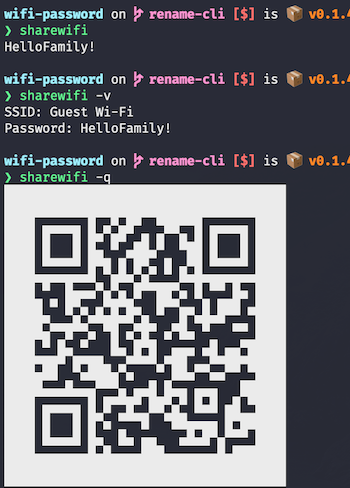
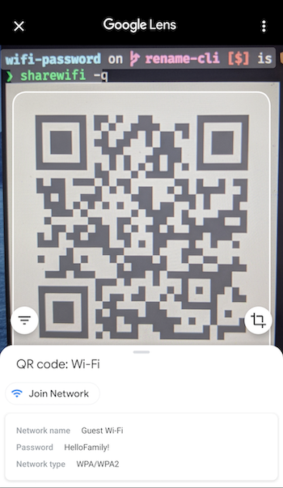

# Share Wi-Fi Connection Info

Quickly share Wi-Fi passwords and connection details. Generates QR codes that auto-configure iOS and Android devices. Compatible with macOS and Windows.

## Usage

```text
sharewifi 0.1.6
Quickly share Wi-Fi passwords and connection details

USAGE:
    sharewifi [FLAGS] [OPTIONS]

FLAGS:
    -a, --always-allow    Disables future confirmation prompts to access this password. Sudo required
    -h, --help            Prints help information
    -q, --qrcode          Prints Wi-Fi Network config QR Code for Android and iOS 11+
    -V, --version         Prints version information
    -v, --verbose         Verbose output

OPTIONS:
    -s, --ssid <ssid>    Specify an SSID.  Defaults to currently connected Wi-Fi
```



**Note:** There is no confirmation prompt required to access the Wi-Fi info on Windows, hence the `always-allow` flag is omitted.

Google Lens displaying QR Code details along with button to join network with single tap:



## Installing

### macOS using Homebew

The easiest way to install sharewifi is by using Homebrew.

```bash
brew tap bradyjoslin/sharewifi
brew install sharewifi
```

### Building and Installing From Source

Building and installing requires [Rust](https://www.rust-lang.org/tools/install). To build, clone the repository and then:

```bash
cargo build
```

To run the debug build:

```bash
cargo run
```

To create a release build:

```bash
cargo build --release
```

To install:

```bash
cargo install --path .
```

## Espanso Integration

[Espanso](https://espanso.org/) is a free cross-platform text expander written in Rust. The [sharewifi espanso package](https://github.com/bradyjoslin/espanso-package-sharewifi/) makes `sharewifi` available via text expansion outside of the command line, including qr code rendering in plain text editors.


## Behind the Scenes

### macOS

Uses two built-in macOS CLI utilities to function under the hood. `airport` gets information on currently connected Wi-Fi, `security` is used to obtain password. Running `security` provides a login prompt to access keychain, as authentication is required in order to obtain the password.

Default macOS `airport` utility location:

`/System/Library/PrivateFrameworks/Apple80211.framework/Versions/Current/Resources/airport`.

Sample usage to obtain SSID:

```bash
> airport -I | awk '/ SSID/ {print substr($0, index($0, $2))}'

Guest WiFi
```

Uses `security` utility to obtain password associated with SSID ([details](https://macromates.com/blog/2006/keychain-access-from-shell/)).

```bash
> security find-generic-password \
-D 'AirPort network password' \
-ga "Guest WiFi" \
2>&1 >/dev/null

password: "HelloFriends!"
```

The `always-allow` option is implemented by updating the System keychain record for that SSID so that `security` is always allowed access to the password. This requires sudo and should only be done for Wi-Fi passwords not considered secret, as will allow this app and others to read the password without credentials.

```bash
sudo security add-generic-password -U -a <ssid> -D "AirPort network password" -T "/usr/bin/security" -s "AirPort"  /Library/Keychains/System.keychain
```


### Windows

Uses this command to get the currently connected Wi-Fi profile and the SSID will be included in the output:

```sh
> netsh wlan show interface

There is 1 interface on the system:

    Name                   : Wi-Fi
    Description            : 802.11n USB Wireless LAN Card
    GUID                   : c1ddfc4d-4b98-4acc-9d84-4f5f845ffb04
    Physical address       : 00:0f:50:01:15:5f
    State                  : connected
    SSID                   : Guest Wi-Fi
    BSSID                  : 21:62:ef:f1:c2:5c
    Network type           : Infrastructure
    Radio type             : 802.11n
    Authentication         : WPA2-Personal
    Cipher                 : CCMP
    Connection mode        : Profile
    Channel                : 1
    Receive rate (Mbps)    : 600
    Transmit rate (Mbps)   : 72
    Signal                 : 100%
    Profile                : Guest Wi-Fi

    Hosted network status  : Not available
```

Then, gets the password for a specific SSID with this command - the `key=clear` option provides the `Key Content` value in the output, which is the Wi-Fi password:

```sh
> netsh wlan show profiles name=myssid key=clear

Profile Guest Wi-Fi on interface Wi-Fi:
=======================================================================

Applied: All User Profile

Profile information
-------------------
    Version                : 1
    Type                   : Wireless LAN
    Name                   : Guest Wi-Fi
    Control options        :
        Connection mode    : Connect manually
        Network broadcast  : Connect only if this network is broadcasting
        AutoSwitch         : Do not switch to other networks
        MAC Randomization  : Disabled

Connectivity settings
---------------------
    Number of SSIDs        : 1
    SSID name              : "Guest Wi-Fi"
    Network type           : Infrastructure
    Radio type             : [ Any Radio Type ]
    Vendor extension          : Not present

Security settings
-----------------
    Authentication         : WPA2-Personal
    Cipher                 : CCMP
    Authentication         : WPA2-Personal
    Cipher                 : GCMP
    Security key           : Present
    Key Content            : HelloFriends!

Cost settings
-------------
    Cost                   : Unrestricted
    Congested              : No
    Approaching Data Limit : No
    Over Data Limit        : No
    Roaming                : No
    Cost Source            : Default
```

## References

QR Code format described in [ZXing docs](https://github.com/zxing/zxing/wiki/Barcode-Contents#wi-fi-network-config-android-ios-11).

Project inspired by [rauchg/wifi-password](https://github.com/rauchg/wifi-password) and [RReverser/WiFi-Password](https://github.com/RReverser/WiFi-Password).
